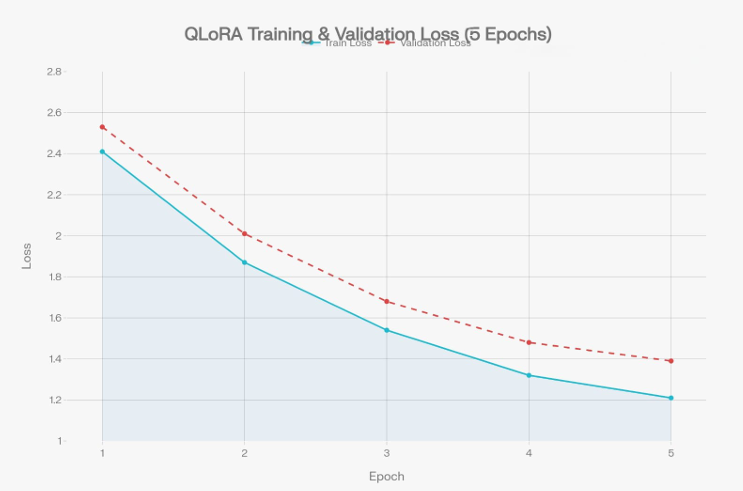
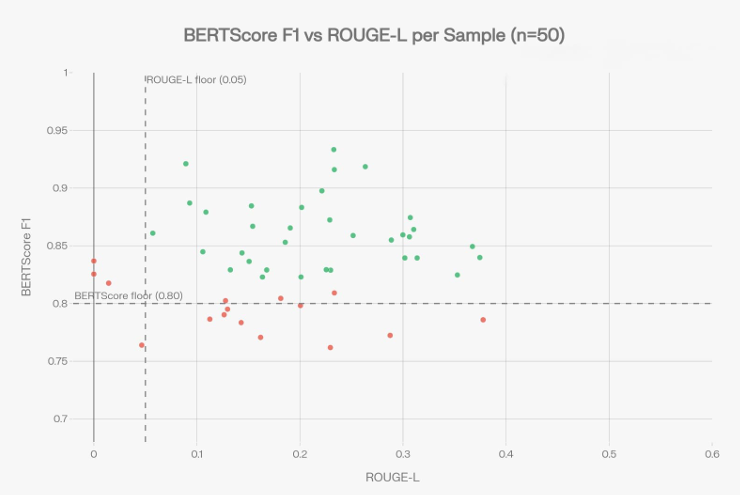

# 🩺 Medical LLM Research: Efficient Domain Adaptation of Small LLMs for Healthcare using QLoRA and Retrieval-Augmented Generation


A research project exploring **consumer-grade medical question answering** through **Phi-3-mini fine-tuning**, **QLoRA**, and **Retrieval-Augmented Generation (RAG)**.

The objective is to investigate whether a compact language model can be effectively adapted for healthcare applications using parameter-efficient fine-tuning and external knowledge retrieval while remaining deployable on affordable consumer hardware.

---

## 🚀 Key Highlights

✅ Fine-tuned **Phi-3-mini-4k-instruct (3.8B)**

✅ Trained entirely on an **RTX 4050 Laptop GPU (6GB VRAM)**

✅ Used **QLoRA (4-bit quantization)** to reduce memory requirements

✅ Updated only **20.5 million parameters (0.54%)**

✅ Built a **FAISS-powered Retrieval-Augmented Generation pipeline**

✅ Evaluated using **BLEU, ROUGE, METEOR, and BERTScore**

✅ Conducted **Base vs Fine-Tuned vs Fine-Tuned + RAG** comparison

✅ Performed hallucination and metric-divergence analysis

---

## 💬 Example

**Question:** What are the symptoms of hypertension?

**Model Response (FT + RAG):**
> Hypertension is often asymptomatic but may present with headaches,
> dizziness, shortness of breath, and nosebleeds in severe cases.
> Regular blood pressure monitoring is recommended for early detection.

---

## 🎯 Research Motivation

Large medical language models often require expensive hardware and cloud resources, limiting accessibility for researchers and students.

This project investigates whether:

- Small LLMs can be adapted to healthcare domains
- QLoRA can enable efficient fine-tuning on low-memory GPUs
- Retrieval-Augmented Generation can further improve answer quality
- Consumer-grade hardware can support meaningful medical AI research

---

## 🏗 System Architecture

**Pipeline Overview**

```text
Medical Datasets
(PubMedQA + MedQA + MedQuAD)
            │
            ▼
     Data Processing
            │
            ▼
      QLoRA Fine-Tuning
            │
            ▼
      Phi-3 Medical
            │
            ▼
        RAG Pipeline
            │
 ┌──────────┴──────────┐
 ▼                     ▼
FAISS Index      User Query
 │                     │
 └──── Retrieval ──────┘
            │
            ▼
      Final Response
```

---

## 📊 Performance Results

| Metric | Base Phi-3 | Fine-Tuned | FT + RAG |
|----------|----------:|----------:|----------:|
| BLEU | 0.038 | 0.134 (+251%) | 🚀 0.151 |
| ROUGE-1 | 0.200 | 0.269 (+34.5%) | 🚀 0.284 |
| ROUGE-L | 0.133 | 0.211 (+59.1%) | 🚀 0.227 |
| METEOR | 0.173 | 0.236 (+36.0%) | 🚀 0.242 (+14.2%) |
| BERTScore F1 | 0.833 | 0.856 (+2.8%) | 🚀 0.859 |

### Key Findings

- BLEU improved by **251%** after QLoRA fine-tuning
- METEOR improved by **14.2%** with RAG augmentation on top of fine-tuning
- Fine-tuning improved both lexical and semantic metrics
- RAG provided additional gains across all evaluation measures
- FT + RAG consistently achieved the strongest overall performance
- Semantic improvements (BERTScore) were more pronounced than lexical metrics (ROUGE/BLEU)

---

## 📈 Training Progress



The training loss demonstrates stable convergence during QLoRA fine-tuning while maintaining low memory consumption.

---

## 🔬 Evaluation Analysis



Comparison of:

- Base Phi-3
- Fine-Tuned Phi-3
- Fine-Tuned Phi-3 + RAG

across multiple automatic evaluation metrics.

---

## 📚 Datasets

The model was trained using a combination of publicly available medical QA datasets.

### PubMedQA
- Biomedical question answering
- Research-oriented medical responses

### MedQA
- USMLE-style medical examination questions
- Clinical reasoning benchmark

### MedQuAD
- Consumer healthcare question answering
- NIH-derived medical content

### Final Dataset Statistics

| Split | Samples |
|---------|---------:|
| Train | 22,068 |
| Validation | 2,758 |
| Test | 2,759 |
| **Total** | **27,585** |

---

## 🤖 Model Configuration

| Parameter | Value |
|------------|--------|
| Base Model | Phi-3-mini-4k-instruct |
| Parameters | 3.82 Billion |
| Quantization | 4-bit NF4 + Double Quantization |
| LoRA Rank | 16 |
| LoRA Alpha | 32 |
| Trainable Parameters | 20.5 Million |
| Updated Parameters | 0.54% |
| Epochs | 5 |
| Learning Rate | 2e-4 |
| Scheduler | Cosine Annealing |
| Warmup Ratio | 0.03 |
| Precision | FP16 |

---

## 🔍 RAG Configuration

| Component | Value |
|------------|--------|
| Embedding Model | all-MiniLM-L6-v2 |
| Vector Database | FAISS |
| Similarity Search | Cosine Similarity |
| Retrieval Type | Dense Retrieval |
| Retrieval Strategy | Top-K (K=3) |
| Knowledge Base | Medical QA Corpus |

---

## 🧪 Research Experiments

The repository includes multiple experimental studies:

### Fine-Tuning vs RAG

```text
Base Phi-3
      ↓
Fine-Tuned Phi-3
      ↓
Fine-Tuned Phi-3 + RAG
```

Evaluates the individual contribution of fine-tuning and retrieval augmentation.

---

### Hallucination Analysis

Implemented dedicated testing to analyze:

- Incorrect medical statements
- Unsupported responses
- Retrieval failures
- Confidence mismatches

---

### Semantic Evaluation

Used:

- BLEU
- ROUGE
- METEOR
- BERTScore

to compare lexical and semantic improvements.

---

### MCQ Benchmarking

Evaluated the model on medical multiple-choice questions and stored:

- Accuracy metrics
- Prediction logs
- Error analysis

---

## 📂 Project Structure

```text
medical-llm-research/
│
├── training/
│   ├── download_datasets.py
│   ├── process_datasets.py
│   ├── split_dataset.py
│   ├── train_qlora.py
│   └── test_medical_model.py
│
├── rag/
│   ├── build_vector_db.py
│   └── ask_medical_question.py
│
├── evaluation/
│   ├── evaluate_model.py
│   ├── mcq_accuracy_results.json
│   └── mcq_errors.json
│
├── experiments/
│   ├── bertscore_evaluation.py
│   ├── rag_vs_ft_evaluation.py
│   ├── hallucination_test.py
│   ├── generate_architecture_diagram.py
│   ├── generate_research_graphs.py
│   └── ...
│
├── data/
│   ├── raw/
│   └── processed/
│
├── models/
│   └── phi3-medical/
│
├── notebooks/
│   ├── environment_test.ipynb
│   └── phi3_test.py
│
├── requirements.txt
├── README.md
└── .gitignore
```

---

## ⚙️ Installation

Clone the repository:

```bash
git clone https://github.com/novvacode/medical-llm-research.git
cd medical-llm-research
```

Create a virtual environment:

```bash
python -m venv venv
```

Activate:

**Windows:**
```bash
venv\Scripts\activate
```

**Linux / macOS:**
```bash
source venv/bin/activate
```

Install dependencies:

```bash
pip install -r requirements.txt
```

---

## ▶️ Usage

### Download Datasets
```bash
python training/download_datasets.py
```

### Process Data
```bash
python training/process_datasets.py
```

### Create Dataset Splits
```bash
python training/split_dataset.py
```

### Fine-Tune Phi-3
```bash
python training/train_qlora.py
```

### Build Vector Database
```bash
python rag/build_vector_db.py
```

### Ask Medical Questions
```bash
python rag/ask_medical_question.py
```

### Run Evaluation
```bash
python evaluation/evaluate_model.py
```

### Run Experiments
```bash
python experiments/bertscore_evaluation.py
python experiments/rag_vs_ft_evaluation.py
python experiments/hallucination_test.py
```

---

## 💻 Hardware Used

| Component | Specification |
|------------|------------|
| GPU | NVIDIA RTX 4050 Laptop GPU |
| VRAM | 6 GB GDDR6 |
| CPU | Intel Core i7-13700HX |
| RAM | 16 GB DDR5 |
| Storage | 1 TB SSD |
| OS | Windows 11 |

---

## 📄 Research Contributions

- Efficient medical-domain adaptation using QLoRA on consumer hardware
- Demonstrated 251% BLEU improvement with only 0.54% trainable parameters
- Retrieval-Augmented Generation integration for improved answer completeness
- Hallucination analysis and lexical vs semantic metric divergence study
- Fully reproducible open-source pipeline for low-cost healthcare AI research

---

## ⚠️ Disclaimer

This project is intended for **research and educational purposes only**.

The generated responses should **not** be used for medical diagnosis, treatment decisions, or professional healthcare advice.

Always consult qualified healthcare professionals.

---

## 👨‍💻 Author

**Daksh**

M.Tech — Computer Science
MIT, Bengaluru
B.Tech— Computer Science
NIT,Jaipur

GitHub: [@novvacode](https://github.com/novvacode)

---

## 🙏 Acknowledgements

- [Microsoft Phi-3](https://huggingface.co/microsoft/Phi-3-mini-4k-instruct)
- [Hugging Face Transformers](https://github.com/huggingface/transformers)
- [PEFT](https://github.com/huggingface/peft)
- [BitsAndBytes](https://github.com/TimDettmers/bitsandbytes)
- [FAISS](https://github.com/facebookresearch/faiss)
- [Sentence Transformers](https://www.sbert.net)
- [TRL](https://github.com/huggingface/trl)
- [PyTorch](https://pytorch.org)
- [PubMedQA](https://pubmedqa.github.io)
- [MedQA](https://github.com/jind11/MedQA)
- [MedQuAD](https://github.com/abachaa/MedQuAD)